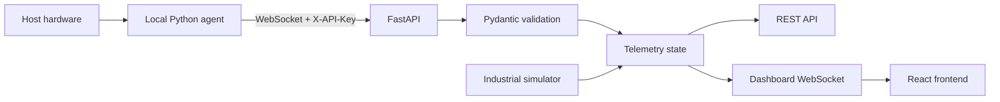

# Backend Architecture

## Why an agent is required

Browsers and cloud servers do not have unrestricted access to host-level hardware.
The agent runs with the user's permission on the target computer and reads only
metrics exposed by its operating system and optional hardware libraries.

## Next production layer

Replace in-memory state with:

- PostgreSQL for metadata
- TimescaleDB for time-series telemetry
- Redis for real-time state/pub-sub
- model registry + versioned ML artifacts
- object storage + vector store for RAG

Keep these concerns behind services/repositories so the API contract remains stable.

## Data integrity

No industrial telemetry is claimed to be real. The simulator uses a seeded,
repeatable mathematical signal and emits `simulated=true`.
